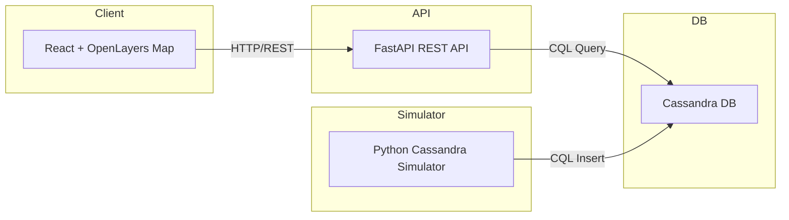
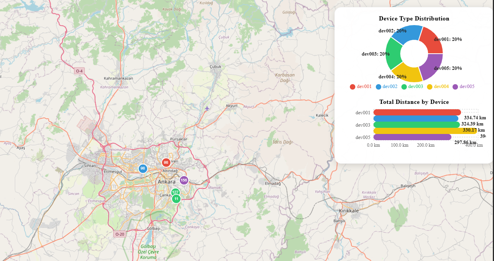

# Real-Time Location Analytics with Cassandra, FastAPI, and React

## Introduction

In this blog post, we explore how to build a real-time location analytics platform using Apache Cassandra for scalable timeseries storage, FastAPI for a modern REST API, and React with OpenLayers for interactive map visualization and analytics dashboards. This Proof of Concept (PoC) demonstrates how to simulate, store, query, and visualize geospatial data efficiently.

---

## Why Cassandra for Timeseries Location Data?

Cassandra is a distributed NoSQL database designed for high write throughput and horizontal scalability. Its data model is ideal for timeseries data, where each device's location points are partitioned by date and device ID, and clustered by timestamp. This ensures fast queries and efficient storage for IoT and mobility scenarios.

---

## System Architecture



- **Simulator:** Python script generates and inserts random device locations into Cassandra.
- **API:** FastAPI exposes endpoints for querying locations, device summaries, and analytics.
- **Client:** React app displays live map, device clusters, and analytics charts.

---

## Key Features

- **Real-time simulation:** Python script continuously inserts location data for multiple devices.
- **REST API:** FastAPI provides endpoints for querying device locations, summaries, and analytics.
- **Interactive dashboard:** React client shows a live map, device clustering, pie chart (device type distribution), and bar chart (total distance per device).
- **Modern UI:** Responsive, visually enhanced dashboard for quick insights.

---

## Example API Endpoints

- `GET /locations?date=YYYY-MM-DD&device_id=dev001&start=YYYY-MM-DDTHH:mm:ss&end=YYYY-MM-DDTHH:mm:ss`  
  All location points for a specific device and date in the given time range.
- `GET /all-locations?date=YYYY-MM-DD&start=YYYY-MM-DDTHH:mm:ss&end=YYYY-MM-DDTHH:mm:ss`  
  All location points for all devices for a specific date and time range.
- `GET /devices-in-range?date=YYYY-MM-DD&start=YYYY-MM-DDTHH:mm:ss&end=YYYY-MM-DDTHH:mm:ss`  
  All unique device IDs with data in the given date and time range.
- `GET /device-summary?device_id=dev001&date=YYYY-MM-DD`  
  Daily movement summary for a device: total point count, first/last location, total distance (meters).

---

## Dashboard Visualizations

- **Map:** Real-time device locations, clustering, and color-coded markers.
- **Pie Chart:** Device type distribution for the selected day.
- **Bar Chart:** Total distance traveled by each device (in km).



---

## How to Run

1. Start Cassandra and API:
   ```
   docker-compose up -d
   python -m venv venv
   .\venv\Scripts\activate
   pip install cassandra-driver fastapi uvicorn
   python cassandra_simulator.py
   python fastapi_cassandra_api.py
   ```
2. Start the React client:
   ```
   cd react-client
   npm install
   npm run dev
   ```
3. Open the client in your browser (usually http://localhost:5173)

---

## Conclusion

This PoC shows how to combine Cassandra, FastAPI, and React to build a scalable, real-time geospatial analytics platform. The architecture is suitable for IoT, fleet management, and smart city applications. You can extend this foundation with more analytics, alerting, or real-time streaming features as needed.

---

*For questions or contributions, feel free to open an issue or pull request!*
