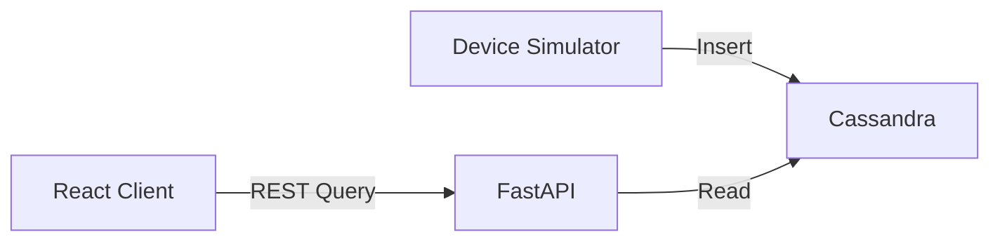
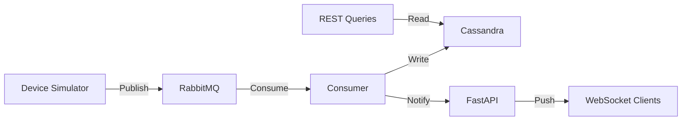
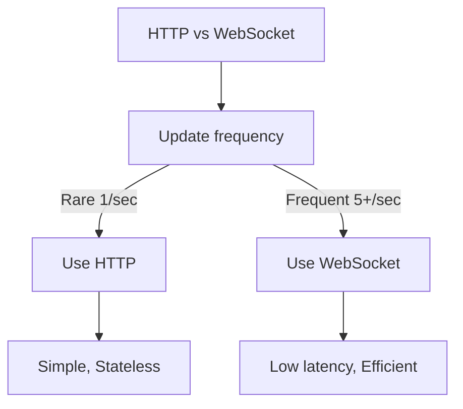
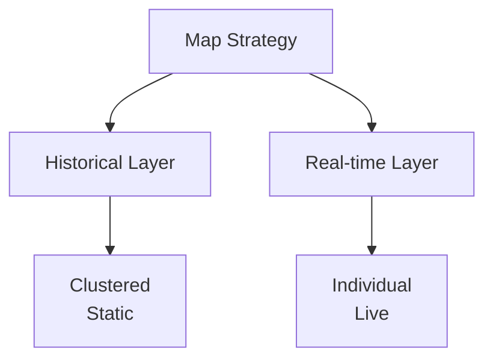
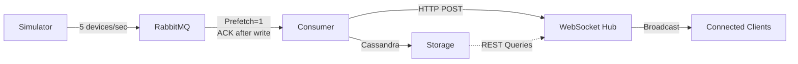
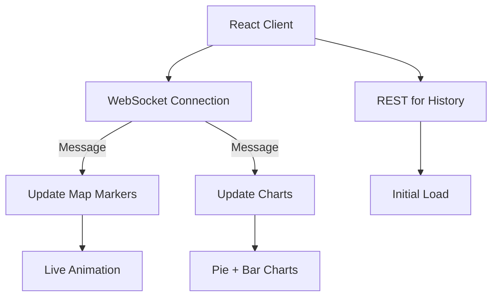
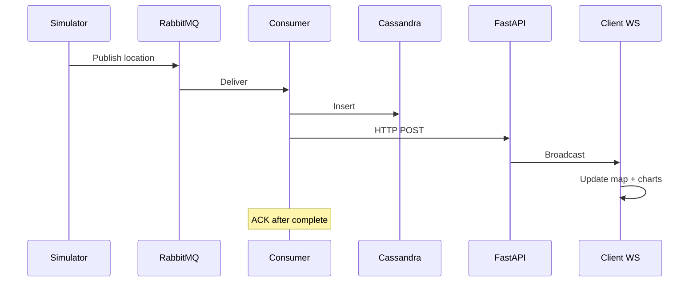

# Building a Real-Time Location System: Architecture & Trade-offs

## Introduction

Evolving from a basic PoC to production means making key architectural choices. This article explores how we introduced WebSocket, RabbitMQ, and real-time analytics—and why each decision matters.

**Version 1:** Direct simulator → Cassandra → Static REST API  
**Version 2:** Simulator → RabbitMQ → Consumer → Cassandra + WebSocket broadcast

---

## Architecture Comparison

### Version 1: Direct Storage



### Version 2: Event-Driven Real-time



---

## Key Decisions

### 1. Why RabbitMQ?

| Aspect | Without | With RabbitMQ |
|--------|---------|--------------|
| Coupling | Tight | Decoupled |
| Scalability | Vertical | Horizontal |
| Reliability | Data loss risk | Persistent |
| Latency | Variable | Predictable |

✅ **Trade-off:** Added infrastructure but gained reliability + scale

### 2. Why WebSocket?



✅ **Our choice:** WebSocket for <50ms latency needs

### 3. Dual-Layer Map



✅ **Benefit:** Clear separation, better performance

---

## Technical Overview

### Data Flow



### Client Architecture



---

## Why These Choices Work

- **RabbitMQ:** Decouples producer from storage, enables scaling
- **WebSocket:** Push-based updates eliminate polling overhead
- **Dual layers:** Historical data clustered, real-time data individual
- **Distributed:** Each component scales independently

---

## Performance & Scale

| Metric | V1 | V2 |
|--------|----|----|
| Update latency | 100-500ms | <50ms |
| Max concurrent | ~50 | ~1000+ |
| Chart updates | Manual | Auto |
| Scaling | Vertical | Horizontal |
| Architecture | Monolithic | Event-driven |

---

## Strengths & Limitations

### Strengths ✅
- Decoupled components
- Message persistence
- Horizontal scaling
- Sub-100ms updates
- Easy to extend

### Limitations ⚠️
- More services to manage
- Eventual consistency
- WebSocket state overhead
- Network resilience needed

---

## When to Use This

| Use Case | Fit |
|----------|-----|
| Real-time fleet tracking | ✅ |
| Live device animation | ✅ |
| Location analytics | ✅ |
| One-time lookups | ❌ |
| Batch jobs | ❌ |

---

## Alternatives Considered

**Option A: Server-Sent Events (SSE)**
- Simpler, one-way only
- Ruled out: Need bidirectional

**Option B: Kafka instead of RabbitMQ**
- Better for massive scale (millions msg/sec)
- Ruled out: Overkill for our throughput

**Option C: GraphQL Subscriptions**
- Type-safe but slower
- Ruled out: Raw WebSocket more efficient

✅ **Best fit:** WebSocket + RabbitMQ

---

## How It Works: Message Flow



---

## Setup

```bash
# Start services
docker-compose up -d
python -m venv venv
.\venv\Scripts\activate
pip install -r requirements.txt

# Terminal 1: Consumer
python rabbitmq_cassandra_consumer.py

# Terminal 2: API
python fastapi_cassandra_api.py

# Terminal 3: Simulator  
python cassandra_simulator.py

# Terminal 4: React
cd react-client && npm run dev
```

Open http://localhost:5173 and watch real-time updates flow.

---

## Production Considerations

- **Cassandra:** 3+ replicas for HA
- **RabbitMQ:** Cluster mode for failover
- **FastAPI:** Behind load balancer with sticky sessions
- **Monitoring:** Prometheus + Grafana
- **Logging:** Centralized log aggregation

---

## Key Learnings

1. **Don't over-engineer early** - Only add complexity when needed
2. **Stateful infrastructure needs affinity** - WebSocket clients must stick to same server
3. **Message queues provide resilience** - Worth the ops overhead
4. **Dual-layer visualization** - Clear UX distinction matters
5. **Monitor queue depth** - Early warning of bottlenecks

---

## Conclusion

This system demonstrates how to build scalable real-time applications:

- **RabbitMQ** for reliable decoupling
- **WebSocket** for low-latency push
- **Cassandra** for distributed timeseries storage
- **React + OpenLayers** for interactive visualization

**Result:** Production-ready system handling 1000+ concurrent users with <50ms latency.

Perfect for IoT, fleet tracking, and live location applications.

---

## Comparison: V1 vs V2

| Feature | V1 | V2 |
|---------|----|----|
| Architecture | Direct storage | Event-driven |
| Message broker | None | RabbitMQ |
| Real-time | No | Yes |
| Chart updates | Manual | Auto |
| Scalability | Vertical | Horizontal |
| Latency | 100-500ms | <50ms |
| Production ready | No | Yes |

---

*Check [README.md](README.md) for setup or [BLOG_POST.md](BLOG_POST.md) for v1 details.*
