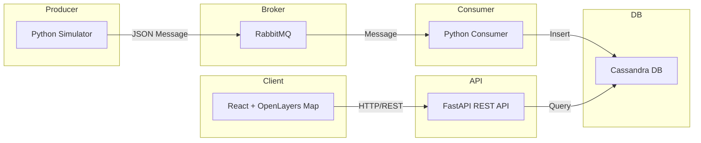

# Cassandra Timeseries Location PoC

## Architecture



This project demonstrates a Proof of Concept for timeseries-based location data storage and querying using Cassandra, RabbitMQ as a message broker, a Python simulator (producer), a Python consumer, and a FastAPI REST API. A React + OpenLayers client is included for map visualization and analytics dashboard.

**Features:**
- Real-time location simulation and message-based ingestion (RabbitMQ)
- Reliable, decoupled, and scalable data pipeline
- FastAPI REST API for querying and reporting
- React client with OpenLayers map, device clustering, and interactive dashboard
- Pie chart for device type distribution
- Bar chart for total distance traveled per device (km)

## Setup

### 1. Start All Services with Docker
```
docker-compose up -d
```

### 2. Create Python Virtual Environment
```
python -m venv venv
```

### 3. Activate Environment
```
# Windows
.\venv\Scripts\activate
# Mac/Linux
source venv/bin/activate
```

### 4. Install Required Packages
```
pip install -r requirements.txt
```


## Simulator (Producer)
To continuously send simulated location data to RabbitMQ:
```
python cassandra_simulator.py
```

## Consumer
To consume messages from RabbitMQ and write to Cassandra:
```
python rabbitmq_cassandra_consumer.py
```


## FastAPI REST API
To start the API server:
```
python fastapi_cassandra_api.py
```


### API Endpoints

- `GET /locations?date=YYYY-MM-DD&device_id=dev001&start=YYYY-MM-DDTHH:mm:ss&end=YYYY-MM-DDTHH:mm:ss`
	- All location points for a specific device and date in the given time range.
- `GET /all-locations?date=YYYY-MM-DD&start=YYYY-MM-DDTHH:mm:ss&end=YYYY-MM-DDTHH:mm:ss`
	- All location points for all devices for a specific date and time range.
- `GET /devices-in-range?date=YYYY-MM-DD&start=YYYY-MM-DDTHH:mm:ss&end=YYYY-MM-DDTHH:mm:ss`
	- All unique device IDs with data in the given date and time range.
- `GET /device-summary?device_id=dev001&date=YYYY-MM-DD`
	- Returns daily movement summary for a device: total point count, first/last location, total distance (meters).

#### Error Handling
- All endpoints return error details in JSON if a query fails.

#### CORS
- CORS is enabled for all origins for development. Adjust `allow_origins` in FastAPI for production.


## Querying Cassandra
In terminal:
```
docker exec -it cassandra-timeseries cqlsh
USE timeseries_location;
SELECT * FROM location_points LIMIT 10;
```


## Notes & Improvements
- Partition key: (date, device_id), clustering key: ts (timestamp)
- Message broker (RabbitMQ) decouples data ingestion and storage for reliability and scalability
- All endpoints are optimized to use partition key (date, device_id) and do not require ALLOW FILTERING for efficient queries
- Python-side deduplication is used for device listing
- React client fetches and displays data on a map, clusters devices, and shows analytics dashboard (pie/bar charts)
- Dashboard is modern, responsive, and visually enhanced
- Error handling and logging improved for easier debugging
- CORS and API structure updated for modern frontend compatibility

---

For issues or feature requests, please contact the maintainer.
